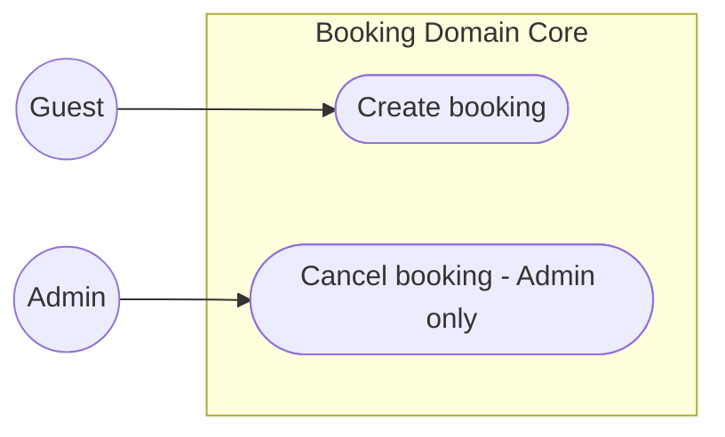

## Use Case Diagram - Booking Core

```mermaid
flowchart LR
  Guest((Guest))
  Admin((Admin))

  subgraph BookingCore["Booking Domain Core"]
    UC1([Create booking])
    UC2([Cancel booking - Admin only])
  end

  Guest --> UC1
  Admin --> UC2
```
