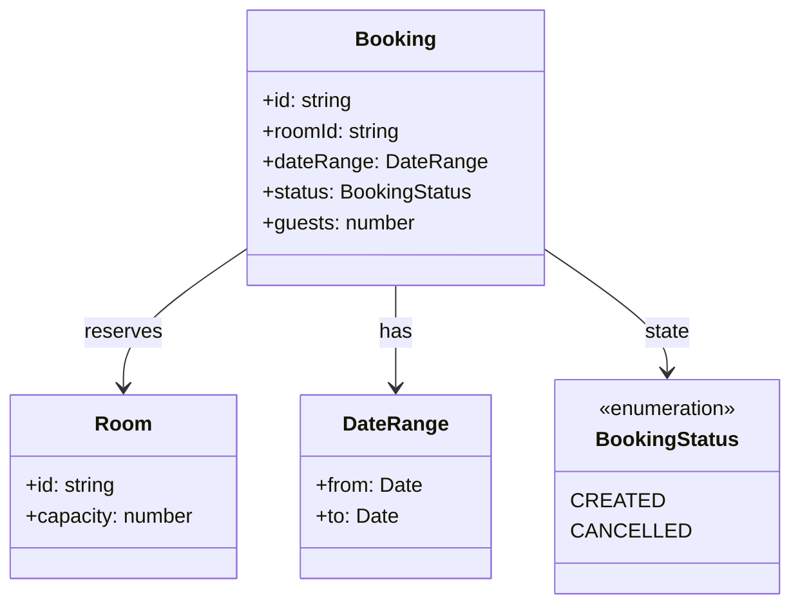

## Domain Model

```mermaid
classDiagram
  class Booking {
    +id: string
    +roomId: string
    +dateRange: DateRange
    +status: BookingStatus
    +guests: number
  }

  class Room {
    +id: string
    +capacity: number
  }

  class DateRange {
    +from: Date
    +to: Date
  }

  class BookingStatus {
    <<enumeration>>
    CREATED
    CANCELLED
  }

  Booking --> Room : reserves
  Booking --> DateRange : has
  Booking --> BookingStatus : state
```
