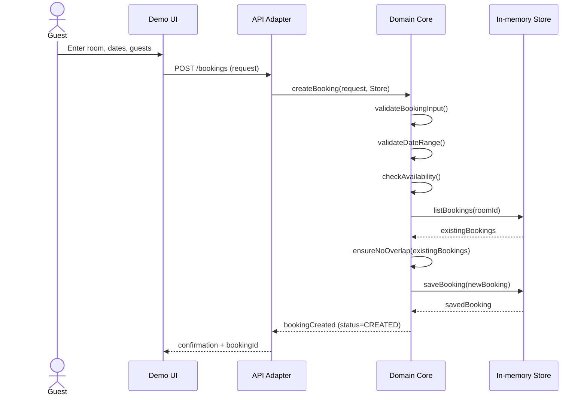

## Sequence Diagram - UC1 Create Booking

```mermaid
sequenceDiagram
  actor Guest
  participant UI as Demo UI
  participant API as API Adapter
  participant Core as Domain Core
  participant Store as In-memory Store

  Guest->>UI: Enter room, dates, guests
  UI->>API: POST /bookings (request)
  API->>Core: createBooking(request, Store)

  Core->>Core: validateBookingInput()
  Core->>Core: validateDateRange()
  Core->>Core: checkAvailability()

  Core->>Store: listBookings(roomId)
  Store-->>Core: existingBookings
  Core->>Core: ensureNoOverlap(existingBookings)

  Core->>Store: saveBooking(newBooking)
  Store-->>Core: savedBooking

  Core-->>API: bookingCreated (status=CREATED)
  API-->>UI: confirmation + bookingId
```
