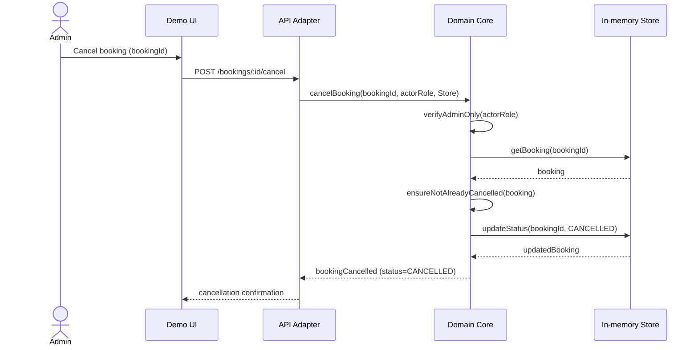

## Sequence Diagram - UC2 Cancel Booking (Admin-only)

```mermaid
sequenceDiagram
  actor Admin
  participant UI as Demo UI
  participant API as API Adapter
  participant Core as Domain Core
  participant Store as In-memory Store

  Admin->>UI: Cancel booking (bookingId)
  UI->>API: POST /bookings/:id/cancel
  API->>Core: cancelBooking(bookingId, actorRole, Store)

  Core->>Core: verifyAdminOnly(actorRole)

  Core->>Store: getBooking(bookingId)
  Store-->>Core: booking

  Core->>Core: ensureNotAlreadyCancelled(booking)
  Core->>Store: updateStatus(bookingId, CANCELLED)
  Store-->>Core: updatedBooking

  Core-->>API: bookingCancelled (status=CANCELLED)
  API-->>UI: cancellation confirmation
```
